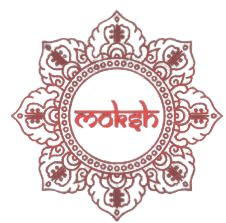
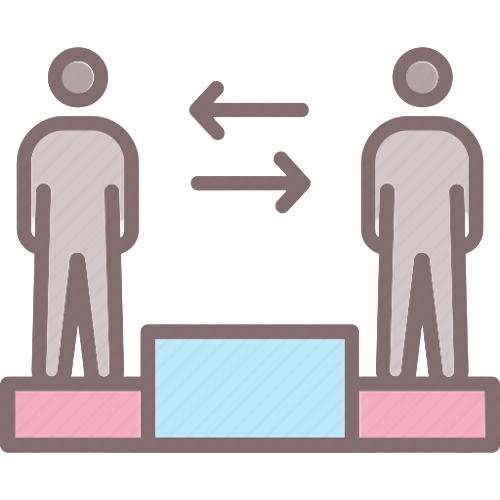

<div align="center">

<h1> MOKSH  </h1>
<a href="https://github.com/akshitagupta15june/Moksh/issues"></a>
<a href="https://github.com/akshitagupta15june/Moksh/pulls"></a>
<a href="https://github.com/akshitagupta15june/Moksh/network/members"></a>
<a href="https://github.com/akshitagupta15june/Moksh/stargazers"></a>
<a href="https://github.com/akshitagupta15june/Moksh/blob/master/LICENSE"></a>
<p align="center">
 
  
 
</p>

### _Unlock your potential and achieve true balance in life with Moksh!_


<h3>Join official <a href="https://discord.com/invite/Jmc97prqjb">Discord </a> for discussion</h3>
<h2></h2>


</div>

## Watch this to know about Moksh (Demo Video)

<h5>Demo Video on Youtube - <a href="https://youtu.be/wfdF___qNME">Link</a> (In case there is an error loading the embedded video below 👇)<h5>

https://github.com/Pratik-11/Moksh/assets/72139212/9a1cad69-7829-4d2b-94e8-9eadb2128b0b
	
		
## 🐦 Latest Tweet


<p>
  <a href="https://www.twitter.com/ExperienceMoksh">
    
  </a>
</p>


## About The Project 💫

### Mental Health Problems

<p align="center">
  
   
  
  
  
</p>

There are numerous mental problems affecting the people in modern society, including fear, false egos, anxiety, comparisons, competitions, peer pressure and stressful work environment. Mental health issues can lead to physical discomforts such as headaches, stomach aches, difficulty sleeping, irritability, and inability to focus. If left unaddressed, chronic stress can exacerbate these symptoms and give rise to more severe health concerns, including anxiety, hypertension, and reduced immunity.

### ✨ A Spiritual Productivity Tool for Mental Wellness

Moksh is a spiritual productivity tool designed for individuals who want to unlock their potential and achieve true balance in life. Our customized spiritual features help you take control of your work, focus on what truly matters, and rejuvenate your mind and spirit. By reading Bhagavad Gita, we become soul conscious and gain the strength to fight life's challenges. With Moksh, you can overcome the mental problems that arise from our body consciousness and find true happiness.

### ✨ Features
* Augmented Reality Bhagavad Gita Meditation 🧘‍♂️
* Connect with ISKCON spiritual events near you 🔗
* Interactive Gita stories for children and students ✍️
* Pomodoro feature(with timer) along with reading Bhagavad Gita shloks in the breaks⌛
* Stress buster spiritual games 🎮
* Bhagavad Gita quiz 🤔
* Random Bhagavad Gita shlok generator with meaning, along with sharing to twitter functionality 🌟
* Rejuvenation section for watching inspirational videos by spiritual leaders ☮️

## Demo

https://akshitagupta15june.github.io/Moksh/

## Doubts

If there are any doubts, you can ask here on Discord. <br>Join your Discord server and ask your doubts.

[](https://discord.gg/Jmc97prqjb)

## Built With

👉 Front-End:

- [HTML](https://html.com)
- [CSS](https://www.css3.com)
- [Bootstrap](https://getbootstrap.com)
- [JavaScript](https://www.javascript.com/)

👉 AR Meditation integration:

- [Echo-AR](https://www.echo3d.com)

👉 Nearest Event Finder:

- [Google Maps API](https://developers.google.com/maps)

## TECH STACK USED


## Getting Started 💨

This is an example of how you may give instructions on setting up your project locally.
To get a local copy up and running follow these simple example steps.

### Installation

1. Clone the repo

```sh
$ git clone https://github.com/akshitagupta15june/Moksh.git
```

2. Open the **index.html** file

3. Have fun!

## Contributing

<div>


</div>

Contributions are what make the open source community such an amazing place to be learn, inspire, and create. Any contributions you make are **greatly appreciated**.

See the [open issues](https://github.com/akshitagupta15june/Moksh/issues) for a list of proposed features (and known issues). You can start by solving the issues marked as **good first issue**.

- If you have any suggestions in the projects, like reporting a bug, improving UI, or improving the README.md file, feel free to **open an issue** to discuss it, or directly create a pull request with the necessary changes.
- Please make sure you check your spelling and grammar.
- Create individual PR for each suggestion.

### Creating A Pull Request

1. Fork the Project
2. Clone your forked repository

```sh
$ git clone https://github.com/<your_github_username>/Moksh.git
```

3. Make the required changes and stage them (`git add .`) or (`git add <file>`)
4. Commit your Changes (`git commit -m 'Made xyz changes'`)
5. Push to your branch (`git push -u origin main`)
6. Open a Pull Request 
## 👩‍💻 Project Admin

<table>
	<tr>
		<td align="center">
			<a href="https://github.com/akshitagupta15june">
				
				<br /> <sub><b>akshitagupta15june</b></sub>
			</a>
			<br /> <a href="https://github.com/akshitagupta15june"> 
		👩‍💻Admin
	    </a>
		</td>
	</tr>
</table>

## 👨‍💻👥 Moderators
<table>
    <tbody>
        <tr>
            <td align="center">
                <a href="https://github.com/mnik7044">
                    
                    <br />
                    <sub><b>Nikhil  Mishra</b></sub>
                </a>
            </td>
            <td align="center">
                <a href="https://github.com/karthiknadar1204">
                    
                    <br />
                    <sub><b>Karthik  Nadar</b></sub>
                </a>
            </td>
            <td align="center">
                <a href="https://github.com/ankitjt">
                    
                    <br />
                    <sub><b>Ankit</b></sub>
                </a>
            </td>
</table>
	
	
<h1>GSSOC'23 Issue TimeLine</h1>
	
	
- Once an issue is assigned,the assignee is expected to submit a pr for review withing a week of the assignment. 
	
- If the assignee fails to comply with the deadline, the issue will be assigned to the next person who had who had requested to be assigned.
	
	

<h1>GSSOC'23 Pointer System</h1>
<h2> Level 1 - Documentation/Minor bug fix </h2>
<h3> Points - 10 </h3>
	
	
- Contributors can update existing documentation, write new documentation for features or code and improve the overall organisation and clarity of the projects documentation.  
	
	
- Minor bug fixes refer to fixing small isolated issues in the codebase.  
	
	
- Fixing issues such as typos, brokel links, or minor performance problems.
	
	
- Bug fixes are an important part of maintaining stability of and reliability of of an open-source project and every bug fix, no matter how small, contributes to the overall health of the project. 
	
	

	
	
<h2> Level 2 - Enhancement of existing features </h2>
<h3> Points - 25 </h3>
	
	
-  Feature or enhancement contributions refer to adding new functionality to an open source project.  
	
- Contributors can add new features, improve existing features, or add new functionality to existing features.
	

	
	
	
	
<h2> Level 3 - Refactoring/ Adding functionalities </h2>
<h3> Points - 45 </h3>
	
	
- Core contributions, such as implementing major features or refactoring significant parts of the codebase. This needs a deep understanding of the codebase and its patterns.
	
	

## Thanks to all Moksh Contributors 💪

Thanks a lot for spending your time helping Moksh grow. Thanks a lot! Keep rocking 🍻
	 
<p>
  
</p>


<h2 align="center"> License 🛡️ </h2>

Distributed under the MIT License. See [LICENSE](https://github.com/akshitagupta15june/Moksh/blob/main/LICENSE) for more information.

<h2 align="center">Code of Conduct</h2>

To maintain a safe and inclusive space for everyone to learn and grow, contributors are advised to follow the [Code of Conduct](./CODE_OF_CONDUCT.md).

<!--
## Code of Conduct

Please ensure you follow the [Code of Conduct](https://github.com/akshitagupta15june/Moksh/blob/main/CODE_OF_CONDUCT.md)  -->

<div align="center">

## Author

[Akshita Gupta](https://github.com/akshitagupta15june)

###  Show some ❤️ by starring this awesome repository! 


</div>
